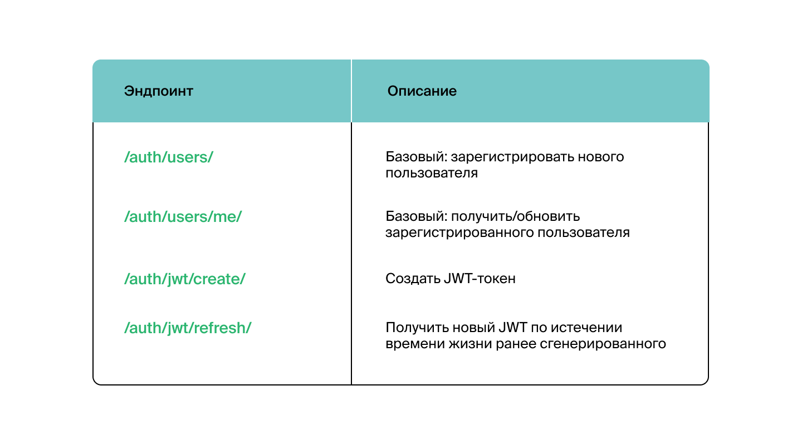

<h1>api final_yatube</h1>

<h3>Как запустить проект:</h3>
Клонировать репозиторий и перейти в него в командной строке:


`git clone git@github.com:KosachMax/api_final_yatube.git`
<br>
`cd api_final_yatube`

---
<h3>Cоздать и активировать виртуальное окружение:</h3>

`python3 -m venv venv`
<br>
`source venv/bin/activate`

---
<h3>Установить зависимости из файла requirements.txt:</h3>

`python3 -m pip install --upgrade pip`
<br>
`pip install -r requirements.txt`

---
<h3>Выполнить миграции:</h3>
`python3 manage.py migrate`

---
<h3>Запустить проект:</h3>

`python3 manage.py runserver`

---
<h1>О проекте:</h1>

<blockquote>Проект выполнен на базе Django Rest Framework — это библиотека, <br>
которая работает со стандартными моделями Django для создания гибкого и мощного API 
для проекта. </blockquote>

---

<h3>Аутентификация:</h3>
<blockquote>Реализация токенов осуществлена с помощью пакета Djoser</blockquote>

---

<h3>Эндпоинты для регистрации, создания и обновления токенов:</h3>

---
<h1>Эндпоинты:</h1>

<h3>Примеры запросов к эндпоинтам:</h3>
Запрос на получение всех постов
<b>GET http://127.0.0.1:8000/api/v1/posts/ </b>
```
{
  "count": 123,
  "next": "http://api.example.org/accounts/?offset=400&limit=100",
  "previous": "http://api.example.org/accounts/?offset=200&limit=100",
  "results": [
    {
      "id": 0,
      "author": "string",
      "text": "string",
      "pub_date": "2021-10-14T20:41:29.648Z",
      "image": "string",
      "group": 0
    }
  ]
}
```

---

Добавление комментария к посту
<b>POST http://127.0.0.1:8000/api/v1/posts/{post_id}/comments/ </b>
```
{
  "text": "string"
}
```
---

<h1>В планах:</h1>
<ul>
<li> Реализовать создание и редактирование групп</li>
<li> Реализовать лайки постов</li>
</ul>

---
<h1>Контакты:</h1>


<a href="https://t.me/kosach1611">Telegram</a><br>

---

